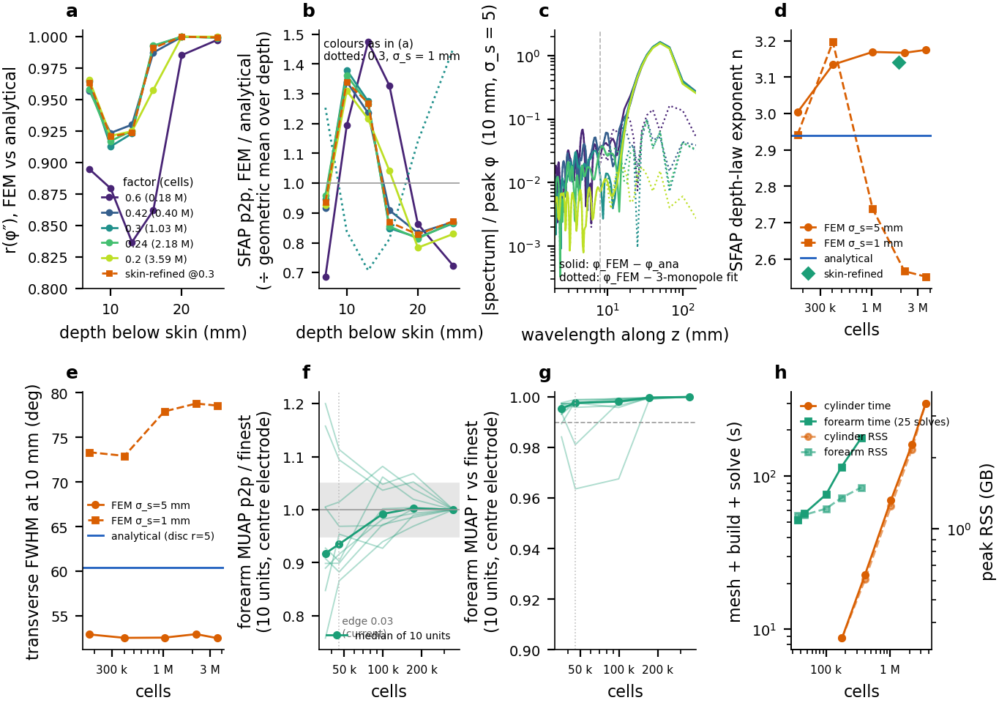

# Mesh convergence: what the finite-element lead field, the direct-recipe SFAP/MUAP and their read-offs do as the mesh is refined

Driver: `scripts/validation/mesh_convergence.py` (cache `_results/validation/mesh_convergence/`, one `.npz` per mesh level, resumable; numbers `key_numbers.json`; figure `docs/validation/figures/mesh_convergence.{png,pdf}`). Run 2026-09-17 on a 12-core / 62 GB WSL2 machine, one finite-element build/solve at a time, four synthesis workers.



*Figure: (a) r(φ″) of the monopole-fitted FEM φ vs the analytical cylinder per depth and mesh; (b) direct-recipe SFAP p2p FEM/analytical per depth, normalised by its geometric mean over depth (dotted: σ_s = 1 mm on the current mesh); (c) amplitude spectrum along z of φ_FEM − φ_ana (solid) and of the mesh ripple φ_FEM − 3-monopole fit (dotted) at 10 mm depth; (d) tier-B5 depth-law exponent vs cells; (e) transverse FWHM at 10 mm vs cells; (f, g) forearm MUAP p2p ratio and r vs the finest mesh for the 10 fixed units on the centre electrode; (h) cost.*

## 1. Why

Mesh resolution had never been varied deliberately. Two open validation items were attributed to it (`docs/validation/PLAN.md`, findings 4 and 5; `DIRECT_LINE_SOURCE.md` §8):

* **(i)** on FEM lead fields the direct recipe's SFAP amplitude is erratic across depth at the ±40 % level (A1.2: FEM/analytical p2p ratio `[1.0, 1.46, 1.35, 1.2, 0.86]` at 7–20 mm), attributed to "mesh structure at ~8 mm wavelength reaching φ″";
* **(ii)** the FEM cylinder's amplitude decays ~30 % differently from the analytical cylinder with depth (B5 exponents 3.17 vs 2.94), "mesh/skin-layer resolution vs the analytical k-grid" still to be attributed.

This study asks, for each read-off the pipeline produces: does it converge with mesh size, at what cost, and does the disagreement with the oracle shrink with it.

## 2. Design

### Part 1 — validation cylinder (analytical oracle)

The cylinder of `scripts/validation/cyl_fem.py`: radii 10 / 35 / 38 / 40 mm (bone / muscle / fat / skin), 240 mm long, Farina-2004 conductivities (`TissueTable.analytical()`: muscle diag(0.1, 0.1, 0.5), fat 0.04, skin 1.0, bone 0.02 S/m), electrode at θ = 0, z = 120 mm, `refine_on="skin"` (gmsh threshold field: the skin volume's boundary surfaces get `size_min = 0.1 × 40 mm` within 2 mm, ramping to `size_max = 0.2 × 40 mm` at 4 mm; everything else `size_max`). `Mesh.CharacteristicLengthFactor` multiplies every size. **The validation cache was built at factor 0.3** (`cyl_fem._model`: `geo.build(..., char_length=0.3)`), not at the builder's 0.2 default — so 0.3 is "current" here and the ladder was placed around it: 0.6, 0.42, 0.3, 0.24, 0.2 (ratios 2, 1.4, 1, 0.8, 0.67 in h; 0.15 would have been ~7 M cells and was left out by the 4 M-cell rule). One local-refinement variant at the current global factor refines the skin/fat shell only: `size_min_factor` 0.1 → 0.075 (`skin075`), i.e. the shell's target size 1.2 → 0.9 mm with the bulk unchanged. The builder has no fibre-band refinement.

Per mesh: `FEMModel` (CG1, GMRES/ILU, rtol 1e-8) and one reciprocal solve for each electrode-source width σ_s ∈ {5 mm (the production value), 1 mm} — a zero-mean Gaussian current source centred on the skin point (half of it lies outside the mesh). φ is sampled every 0.5 mm along full-length fibre lines at radial positions 33 / 30 / 27 / 25 / 24 / 20 / 15 mm (7 / 10 / 13 / 15 / 16 / 20 / 25 mm below the skin) and angles 0–180°, on a full-circle transverse profile at z = z_e, and on the radial line under the electrode. Everything downstream is the tier-A machinery on the same windows: `cyl_fem.window` re-grids each line onto the analytical grid (256 samples at dz = v/fs = 0.977 mm, centred on z_e), the analytical φ is `harness.ana_phi` (Farina 2004, disc electrode of radius 5 mm), the SFAP is `harness.sfap` (the direct recipe, `golden_cfg`: 3-monopole fit, 2× upsampling, φ″ source, one-sided tendon window; fibre 60 + 60 mm, NMJ at −20 mm) and the tier-B5 depth law is `power_law(depth, p2p(sfap(φ, 100, 100, −20)))` over 7 / 10 / 13 / 15 / 20 / 25 mm.

Metrics per mesh, σ_s and depth (7 / 10 / 13 / 16 / 20 / 25 mm), all on the fibre core |z| ≤ 60 mm:

* `r(φ)` — correlation of the DC-free φ with the analytical one (A1.1);
* `r(φ″)` — correlation of φ″ = d²φ/dz² of the **3-monopole-fitted** FEM φ with the analytical φ″ at the disc radius 5 mm (A1.1b's definition; the best of 2.5 / 5 / 7.5 / 10 mm is also recorded), and of the **raw** FEM φ″;
* the error spectrum along z: `φ_FEM − a·φ_ana` on |z| ≤ 100 mm, `a` a least-squares scale (the two φ differ by a constant unit-convention factor of 7–11; tier A only ever compared shapes), Hann-tapered, as the fraction of error power in the wavelength bands > 40 / 15–40 / 6–15 / < 6 mm, and the same for the FEM-only residual `φ_FEM − monopole fit` (the mesh ripple the recipe removes);
* SFAP jaggedness (`synthesis.metrics.jaggedness`) with `denoise="none"` and with the recipe (A2.2);
* the direct-recipe SFAP p2p, FEM / analytical, reported relative to the 7 mm fibre (the A1.2 convention) and decomposed into a power-law trend across depth plus a residual scatter (rms and max, in %);
* the tier-B5 depth-law exponent n (analytical 2.94);
* the transverse FWHM of φ at z = z_e across the angle θ at the fibre radius, referenced to the antipode θ = 180° (the FEM's zero-mean solve and the analytical model carry different baselines), in degrees; ×40 mm gives the arc at the skin;
* the end-of-fibre onset vs L/v at 10 mm depth (A2.3: SFAP(L) − SFAP(L + 60) with a boxcar window, L = 40 and 60 mm).

Convergence is read two ways: against the analytical oracle (which also carries every modelling difference: the Gaussian-blob electrode vs a surface disc, the finite 240 mm Neumann cylinder vs the infinite one, the oracle's periodic 250 mm window), and **FEM against FEM between successive levels and against the finest level**, which is the pure discretisation error.

### Part 2 — MRI forearm (no oracle)

`emgforge.mri.pipeline` on the committed WR segmentation, FCU (label 8), 5 × 5 grid at 10 mm, the released recipe (`production_config()`: fs 2048 Hz, v = 4 m/s, w = 256, 3-monopole conditioning), σ_s = 5 mm, skin shell 1.5 mm, `sigma_mode="centerline"`. The fTetWild `edge_length` ladder is 0.05, 0.03 (current, the released 47 k-tet resolution), 0.02, 0.015, 0.012; `target_z = 1.5 mm`, `surface_faces = 50 000`, `smooth_iters = 10` are the pipeline defaults and were held fixed (the cap was 1 M cells; 0.012 was predicted from the cubic rule and run).

What is held fixed across levels: the fibre bed (`poisson_bed`, density 4 / mm², seed 0: 637 straight morphing-disk fibres × 200 points) and the 20-unit Henneman pool (seed 0) are built from the segmentation only — each worker rebuilds them and asserts the SHA-1 of the bed paths against the reference level, so the fibres and units are bit-identical at every level; the 25 electrodes are placed once on the current mesh by `grid_electrodes` and, for every other level, re-hit on that level's own skin along the same ray (limb axis at the row's z → electrode direction), so the only thing an electrode does between levels is follow the skin surface (the recorded displacement is the surface's own change). The MUAP tensor is computed for all 20 units on all 25 electrodes; the read-offs use ~10 fixed units (size terciles × shallowest / median / deepest, plus the largest unit) on the centre electrode and on the largest-amplitude column of the current level, plus the whole tensor for the CV read-off (`scripts/run_pipeline.py::cv_readoff`, single-differential column through the muscle).

Metrics: per level the monopole-fit residual (rms / p2p) over all 25 × 637 electrode–fibre pairs, the CV read-off, and the amplitude scatter across depth (p2p per fibre on the centre electrode vs the unit's distance to that electrode → power law → rms residual, the forearm analogue of item (i)); between successive levels `r(φ)` and `r(φ″)` (raw and conditioned) along the bed, and for the fixed units the MUAP p2p ratio, waveform r (same time base), duration ratio (10 % of |peak|) and the CV change. The verdict criterion: the coarsest level whose MUAPs change by < 5 % (median over the fixed units, centre and column) with r > 0.99 against the next finer level.

## 3. Part 1 — cylinder: what converges, what does not

Six meshes: five global levels and the skin-refined variant. Nothing was skipped (0.2 came in at 3.6 M cells, under the 4 M rule; 0.15 would have been ~7 M). Element size h is the edge of the regular tetrahedron with the cell's volume, median per tissue.

### Cylinder — cost per level

| level | factor | cells | nodes | h skin / fat / muscle (mm) | gmsh (s) | model build (s) | solve σ5 / σ1 (s) | peak RSS (GB) |
|---|---|---|---|---|---|---|---|---|
| cyl_f0.6 | 0.6 | 176,478 | 35,801 | 2.43 / 2.90 / 5.04 | 6 | 2 | 1 / 1 | 0.3 |
| cyl_f0.42 | 0.42 | 404,348 | 80,131 | 1.92 / 2.29 / 3.58 | 17 | 4 | 2 / 2 | 0.6 |
| cyl_f0.3 | 0.3 | 1,032,404 | 194,826 | 1.53 / 1.61 / 2.56 | 50 | 13 | 6 / 6 | 1.2 |
| cyl_f0.24 | 0.24 | 2,183,157 | 393,300 | 1.08 / 1.23 / 2.03 | 114 | 31 | 16 / 15 | 2.2 |
| cyl_f0.2 | 0.2 | 3,587,142 | 635,199 | 0.96 / 1.06 / 1.69 | 209 | 58 | 32 / 31 | 3.4 |
| cyl_f0.3_skin075 | 0.3 + skin075 | 1,902,902 | 353,897 | 1.05 / 1.16 / 2.45 | 110 | 27 | 14 / 13 | 1.9 |

### 3.1 φ itself converges early; raw φ″ never does

Between successive meshes the DC-free φ along every fibre is already r ≥ 0.9999 from 0.42 → 0.3 on (σ_s = 5 mm) and its peak at the fibre is within 1 % of the 3.6 M-cell answer from 0.3 on (σ_s = 5) — for σ_s = 1 mm the peak is 3 % off at 0.3 and 1 % at 0.24 (the 1 mm source needs skin cells of ~1 mm, which is what 0.24 provides). The raw second derivative is a different story: **r(φ″_raw) between any two successive meshes is ≈ 0 (−0.11, 0.00, 0.13, 0.25) up to 3.6 M cells**. The second difference of a CG1 field on a 1 mm grid is mesh noise at every resolution we can afford; its rms relative to the φ peak (the residual of φ from its own 3-monopole fit) falls only from 0.0055 (0.6) to 0.0037 (0.3) and 0.0006–0.0018 (0.2) at 10–25 mm, and the wavelength where it peaks wanders over 7–14 mm without tracking h (muscle h = 5.0 → 1.7 mm). The "~8 mm structure" is real but it is *not a fixed mesh wavelength*: it is broadband ripple with 40–60 % of its power in the 6–15 mm band and 10–35 % below 6 mm at every level. So the recipe's monopole fit is load-bearing on every affordable mesh, not a patch for a coarse one — the SFAP computed with `denoise="none"` still changes by 7 % (median) / 36 % (max) between the two finest meshes and by 15–46 % between 0.3 and 0.24.

### Cylinder — successive-level convergence (FEM vs FEM, no oracle)

| coarse → fine | cells | σ_s | min r(φ) | min r(φ″) raw | min r(φ″) mono | min SFAP r (recipe / no denoise) | SFAP p2p change, recipe: median / max (%) | no denoise: median / max (%) | Δ n_SFAP | Δ FWHM_t@10 (°) |
|---|---|---|---|---|---|---|---|---|---|---|
| cyl_f0.6 → cyl_f0.42 | 0.18 → 0.40 M | 5 | 0.9986 | -0.11 | 0.865 | 0.919 / 0.195 | 20.7 / 82.9 | 57.0 / 162.4 | +0.13 | -0.4 |
| cyl_f0.6 → cyl_f0.42 | 0.18 → 0.40 M | 1 | 0.9974 | -0.04 | 0.492 | 0.733 / 0.178 | 12.9 / 58.4 | 83.9 / 125.0 | +0.25 | -0.4 |
| cyl_f0.42 → cyl_f0.3 | 0.40 → 1.03 M | 5 | 0.9999 | -0.00 | 0.997 | 0.998 / 0.371 | 2.1 / 8.2 | 34.7 / 96.3 | +0.03 | +0.0 |
| cyl_f0.42 → cyl_f0.3 | 0.40 → 1.03 M | 1 | 0.9985 | -0.01 | 0.914 | 0.953 / 0.463 | 21.6 / 97.4 | 71.9 / 118.4 | -0.46 | +5.0 |
| cyl_f0.3 → cyl_f0.24 | 1.03 → 2.18 M | 5 | 1.0000 | 0.13 | 0.998 | 0.998 / 0.749 | 1.3 / 2.6 | 14.4 / 45.8 | -0.00 | +0.4 |
| cyl_f0.3 → cyl_f0.24 | 1.03 → 2.18 M | 1 | 0.9997 | 0.19 | 0.980 | 0.987 / 0.746 | 2.2 / 27.0 | 15.8 / 63.7 | -0.17 | +0.9 |
| cyl_f0.24 → cyl_f0.2 | 2.18 → 3.59 M | 5 | 1.0000 | 0.25 | 0.984 | 0.981 / 0.789 | 0.3 / 20.8 | 7.3 / 35.9 | +0.01 | -0.4 |
| cyl_f0.24 → cyl_f0.2 | 2.18 → 3.59 M | 1 | 1.0000 | 0.27 | 0.999 | 0.999 / 0.825 | 0.8 / 3.4 | 20.2 / 40.4 | -0.01 | -0.2 |

### 3.2 Against the oracle: the disagreement is not mesh-limited

The FEM-vs-analytical error of φ is 75–99 % at wavelengths > 40 mm from 0.42 on, i.e. it is the smooth modelling difference (electrode model, finite Neumann cylinder, the oracle's periodic window), with < 1 % of the error power in the 6–15 mm band at any depth ≥ 10 mm. Every oracle-level metric of tier A is the same number from 0.42 on:

* **r(φ″) after the monopole fit (A1.1b)**: 0.96 / 0.92 / 0.93 / 0.99 / 1.00 / 1.00 at 7 / 10 / 13 / 16 / 20 / 25 mm on 0.42, 0.3, 0.24 and 0.2 alike. The A1.1b fail (0.92–0.93 at 10–13 mm) is not a mesh effect.
* **The A1.2 amplitude scatter (open item i)**: FEM/analytical p2p relative to 7 mm is [1.00, 1.46, 1.35, 0.90, 0.86, 0.91] at 0.3 and [1.00, 1.42, 1.32, 0.89, 0.85, 0.91] at 0.24 (rms scatter about a power law 18–19 %, max 25–27 %) — unchanged from 0.42 to 3.6 M cells. Only the 0.6 mesh (muscle h = 5 mm) is worse (35 % / 49 %). The scatter is not mesh ripple reaching φ″: with the fit in place the FEM φ″ is stable across meshes (r ≥ 0.997) while its disagreement with the analytical φ″ is constant. What *does* move the recipe's amplitude is the fit itself: between 0.24 and 0.2 the raw φ at 16 mm is identical (r = 1.0000, peak ratio 1.000) yet the recipe's SFAP p2p changes by 21 % because the greedy 3-monopole fit lands on a different solution; the skin-refined variant, whose φ agrees with the 0.3 mesh to r = 0.9999 at every depth, moves the recipe p2p by up to 3.6 % (σ_s = 5) and 18 % (σ_s = 1, 7 mm). The ±40 % item is therefore the **3-monopole model's misfit at shallow depth and its sensitivity to sub-1e-4 changes in φ**, not mesh resolution; a finer mesh cannot fix it.
* **The depth-law exponent (open item ii)**: σ_s = 5 mm gives 3.00 → 3.13 → 3.17 → 3.17 → 3.17 (7–25 mm; 3.44 / 3.42 / 3.42 over 10–25 mm) — converged to ±0.01 at 0.3 — against the analytical 2.94 (2.84 over 10–25 mm; 2.95 with the oracle at w = 512). The gap is not mesh-limited. It is source-model-limited: with σ_s = 1 mm the converged exponent is 2.55–2.57 (0.24 / 0.2), i.e. **the sign of the gap flips with the source width**; the σ_s = 1 mm ladder (2.94 → 3.20 → 2.74 → 2.57 → 2.55) also shows that the earlier "σ = 1 mm gives the same drift" reading was taken on a mesh (0.3, skin h = 1.5 mm) that had not resolved a 1 mm source. At the φ level the FEM peak decays as d^−1.26 (σ_s = 5) / d^−1.09 (σ_s = 1) against the oracle's d^−1.53 at w = 256 and d^−1.41 at w = 512 — the oracle's own φ-level law shifts by 0.12 with its window (its φ at w = 256 has edges at −27 … −64 % of the peak, the periodic 250 mm window wrapping the tails), while its SFAP exponent barely moves (2.94 → 2.95). Note the direction: at the SFAP level the FEM (σ_s = 5) decays *faster* than the analytical (3.17 > 2.94), the "30 % slower" wording in the plan came from the A1.2 ratio rising 1.0 → 1.46 between 7 and 10 mm, which is the shallow-fibre misfit above, not a depth law.
* **Transverse FWHM at 10 mm** (antipode-referenced, at z = z_e): 53° at every level for σ_s = 5 mm (analytical disc r = 5 mm: 60°) and 73 → 73 → 78 → 79 → 79° for σ_s = 1 mm — the 1 mm source converges at 0.24. The blob electrode is narrower than the disc transversally and the width is a property of the electrode model, converged at the current mesh.
* **EOF onset** (A2.3): +0.26 / +0.39 ms after L/v for L = 40 / 60 mm at every mesh and both σ_s, and exactly the same on the analytical φ — entirely determined by the recipe's window and sampling.
* **SFAP jaggedness at 10 mm**: raw 0.017 → 0.015 → 0.011 → 0.008 → 0.004 (falls with h), after the fit 0.002–0.003 at every level (A2.2 holds on every mesh).
* **Lateral fibres** (A1.3, 10–45°): r(φ) ≥ 0.996 at every level.

### Cylinder vs analytical, σ_s = 5 mm

| level | r(φ) min | r(φ″) mono @7/10/13/16/20/25 | r(φ″) raw @10 | SFAP p2p ratio rel. 7 mm | scatter rms / max (%) | n_SFAP (ana 2.94) | jag raw→mono @10 | FWHM_t @10 (°, ana 60) | EOF Δ L40/L60 (ms) |
|---|---|---|---|---|---|---|---|---|---|
| cyl_f0.6 | 0.9929 | 0.89/0.88/0.84/0.86/0.99/1.00 | 0.58 | [1.00, 1.74, 2.15, 1.93, 1.26, 1.05] | 35 / 49 | 3.00 | 0.017→0.003 | 53 | +0.26 / +0.39 |
| cyl_f0.42 | 0.9949 | 0.96/0.92/0.93/0.99/1.00/1.00 | 0.64 | [1.00, 1.46, 1.35, 0.99, 0.91, 0.95] | 18 / 26 | 3.13 | 0.015→0.002 | 53 | +0.26 / +0.39 |
| cyl_f0.3 | 0.9948 | 0.96/0.91/0.92/0.99/1.00/1.00 | 0.73 | [1.00, 1.46, 1.35, 0.90, 0.86, 0.91] | 19 / 27 | 3.17 | 0.011→0.002 | 53 | +0.26 / +0.39 |
| cyl_f0.24 | 0.9951 | 0.96/0.92/0.93/0.99/1.00/1.00 | 0.79 | [1.00, 1.42, 1.32, 0.89, 0.85, 0.91] | 18 / 25 | 3.17 | 0.008→0.002 | 53 | +0.26 / +0.39 |
| cyl_f0.2 | 0.9953 | 0.97/0.92/0.92/0.96/1.00/1.00 | 0.90 | [1.00, 1.41, 1.31, 1.12, 0.85, 0.90] | 18 / 26 | 3.17 | 0.004→0.002 | 53 | +0.26 / +0.39 |
| cyl_f0.3_skin075 | 0.9952 | 0.96/0.92/0.92/0.99/1.00/1.00 | 0.77 | [1.00, 1.43, 1.36, 0.93, 0.88, 0.93] | 18 / 25 | 3.14 | 0.011→0.002 | 53 | +0.26 / +0.39 |

### Cylinder vs analytical, σ_s = 1 mm

| level | r(φ) min | r(φ″) mono @7/10/13/16/20/25 | r(φ″) raw @10 | SFAP p2p ratio rel. 7 mm | scatter rms / max (%) | n_SFAP (ana 2.94) | jag raw→mono @10 | FWHM_t @10 (°, ana 60) | EOF Δ L40/L60 (ms) |
|---|---|---|---|---|---|---|---|---|---|
| cyl_f0.6 | 0.9986 | 0.68/0.99/0.98/1.00/0.99/0.99 | 0.38 | [1.00, 0.69, 0.77, 0.60, 0.74, 0.92] | 18 / 29 | 2.94 | 0.021→0.002 | 73 | +0.26 / +0.39 |
| cyl_f0.42 | 0.9975 | 0.63/0.99/1.00/1.00/0.99/0.99 | 0.41 | [1.00, 0.45, 0.36, 0.39, 0.49, 0.62] | 38 / 57 | 3.20 | 0.024→0.002 | 73 | +0.26 / +0.39 |
| cyl_f0.3 | 0.9987 | 0.86/1.00/0.99/0.99/0.99/0.99 | 0.55 | [1.00, 0.67, 0.56, 0.65, 0.91, 1.16] | 28 / 40 | 2.74 | 0.021→0.002 | 78 | +0.26 / +0.39 |
| cyl_f0.24 | 0.9986 | 0.94/1.00/0.98/0.99/0.99/0.99 | 0.67 | [1.00, 0.86, 0.73, 0.85, 1.18, 1.51] | 22 / 33 | 2.57 | 0.014→0.002 | 79 | +0.26 / +0.39 |
| cyl_f0.2 | 0.9985 | 0.93/1.00/0.98/0.99/0.99/0.99 | 0.93 | [1.00, 0.83, 0.72, 0.85, 1.19, 1.51] | 22 / 33 | 2.55 | 0.010→0.002 | 79 | +0.26 / +0.39 |
| cyl_f0.3_skin075 | 0.9985 | 0.94/1.00/0.98/0.99/1.00/0.99 | 0.69 | [1.00, 0.82, 0.70, 0.89, 1.18, 1.47] | 22 / 37 | 2.57 | 0.015→0.002 | 78 | +0.26 / +0.39 |

### Cylinder — relative to the finest global level, per depth (7/10/13/16/20/25 mm)

| level | σ_s | φ peak ratio | SFAP p2p ratio, recipe | SFAP p2p ratio, no denoise |
|---|---|---|---|---|
| cyl_f0.6 | 5 | 0.953, 1.021, 1.090, 1.096, 1.057, 1.033 | 0.917, 1.127, 1.500, 1.576, 1.363, 1.078 | 1.270, 1.257, 2.114, 3.065, 5.894, 5.693 |
| cyl_f0.6 | 1 | 1.193, 1.173, 1.176, 1.158, 1.127, 1.107 | 1.827, 1.533, 1.959, 1.280, 1.140, 1.112 | 2.272, 3.136, 3.940, 3.711, 4.798, 5.612 |
| cyl_f0.42 | 5 | 0.985, 1.006, 1.021, 1.020, 1.019, 1.017 | 0.977, 1.010, 1.004, 0.862, 1.050, 1.035 | 1.073, 1.153, 1.514, 1.759, 2.246, 3.096 |
| cyl_f0.42 | 1 | 1.189, 1.071, 1.043, 1.031, 1.027, 1.025 | 2.496, 1.353, 1.236, 1.139, 1.036, 1.024 | 2.750, 2.201, 2.147, 2.014, 2.132, 2.782 |
| cyl_f0.3 | 5 | 0.993, 1.001, 1.009, 0.999, 1.008, 1.009 | 0.999, 1.029, 1.025, 0.796, 1.020, 1.020 | 1.083, 1.164, 0.972, 0.896, 1.978, 1.811 |
| cyl_f0.3 | 1 | 1.006, 0.975, 0.973, 0.964, 0.969, 0.971 | 1.265, 1.023, 0.988, 0.965, 0.965, 0.968 | 1.699, 1.449, 0.983, 1.107, 1.697, 1.476 |
| cyl_f0.24 | 5 | 0.992, 0.996, 1.007, 1.000, 0.999, 1.002 | 0.999, 1.003, 1.004, 0.792, 1.003, 1.010 | 0.959, 1.082, 1.044, 1.065, 1.356, 1.359 |
| cyl_f0.24 | 1 | 0.991, 0.991, 0.997, 0.992, 0.991, 0.993 | 0.995, 1.034, 1.000, 0.994, 0.987, 0.991 | 1.038, 1.404, 1.146, 1.132, 1.260, 1.258 |
| cyl_f0.2 | 5 | 1.000, 1.000, 1.000, 1.000, 1.000, 1.000 | 1.000, 1.000, 1.000, 1.000, 1.000, 1.000 | 1.000, 1.000, 1.000, 1.000, 1.000, 1.000 |
| cyl_f0.2 | 1 | 1.000, 1.000, 1.000, 1.000, 1.000, 1.000 | 1.000, 1.000, 1.000, 1.000, 1.000, 1.000 | 1.000, 1.000, 1.000, 1.000, 1.000, 1.000 |
| cyl_f0.3_skin075 | 5 | 0.990, 1.000, 1.010, 1.003, 1.011, 1.010 | 0.981, 0.992, 1.013, 0.810, 1.026, 1.021 | 0.957, 0.987, 1.118, 1.042, 1.419, 1.756 |
| cyl_f0.3_skin075 | 1 | 1.017, 1.012, 1.010, 1.007, 1.012, 1.012 | 1.040, 1.030, 1.010, 1.090, 1.029, 1.012 | 1.233, 1.485, 1.393, 1.144, 1.480, 1.590 |

### 3.3 The skin-refined variant buys nothing

Refining the skin/fat shell from 1.5 to 1.05 mm at the current global factor (1.9 M cells, the cost of the 0.24 global level) leaves φ at r = 0.9999 to the 0.3 mesh at every depth, the exponent at 3.14 vs 3.17 and the transverse FWHM unchanged; the recipe's p2p moves by 2–4 % (σ_s = 5) through the fit. The "skin-layer resolution" hypothesis for item (ii) is closed.

### Cylinder — skin-refined variant vs the current global mesh (same factor 0.3)

| σ_s | r(φ) per depth | r(φ″) raw per depth | SFAP p2p variant / current per depth |
|---|---|---|---|
| 5 | 0.9999, 1.0000, 0.9999, 0.9999, 0.9999, 0.9999 | 0.83, 0.71, 0.48, 0.42, 0.14, 0.28 | 0.983, 0.964, 0.988, 1.016, 1.006, 1.001 |
| 1 | 0.9997, 0.9999, 1.0000, 1.0000, 1.0000, 0.9999 | 0.35, 0.52, 0.34, 0.45, 0.13, 0.25 | 0.822, 1.006, 1.022, 1.130, 1.066, 1.045 |

### 3.4 Error spectra along z (tables)

The two tables behind §3.1–3.2: where the FEM-vs-oracle error and the FEM-only mesh ripple sit in wavelength, per level and depth (7 / 10 / 16 / 25 mm).

### Cylinder — error spectrum of φ along z (σ_s = 5 mm; scale-matched φ_FEM − φ_ana on |z| ≤ 100 mm; Hann)

| level | depth | err rms / peak | error power in λ > 40 / 15–40 / 6–15 / < 6 mm | error peak λ (< 40 mm) | monopole-residual rms / peak | residual power > 40 / 15–40 / 6–15 / < 6 | residual short-λ (< 15 mm) rms / peak | short-λ peak (mm) |
|---|---|---|---|---|---|---|---|---|
| cyl_f0.6 | 7 | 0.015 | 0.60 / 0.24 / 0.12 / 0.05 | 33 | 0.0057 | 0.13 / 0.17 / 0.41 / 0.29 | 0.0048 | 7.4 |
| cyl_f0.6 | 10 | 0.022 | 0.75 / 0.24 / 0.00 / 0.00 | 33 | 0.0055 | 0.35 / 0.30 / 0.15 / 0.19 | 0.0032 | 12.5 |
| cyl_f0.6 | 16 | 0.019 | 0.83 / 0.14 / 0.02 / 0.01 | 33 | 0.0043 | 0.03 / 0.41 / 0.43 / 0.13 | 0.0032 | 12.5 |
| cyl_f0.6 | 25 | 0.009 | 0.55 / 0.27 / 0.16 / 0.03 | 29 | 0.0068 | 0.42 / 0.35 / 0.20 / 0.03 | 0.0033 | 14.3 |
| cyl_f0.42 | 7 | 0.018 | 0.58 / 0.40 / 0.01 / 0.01 | 33 | 0.0045 | 0.22 / 0.21 / 0.29 / 0.28 | 0.0034 | 6.7 |
| cyl_f0.42 | 10 | 0.022 | 0.78 / 0.21 / 0.00 / 0.00 | 33 | 0.0041 | 0.08 / 0.29 / 0.37 / 0.25 | 0.0032 | 14.3 |
| cyl_f0.42 | 16 | 0.011 | 0.90 / 0.06 / 0.02 / 0.03 | 33 | 0.0045 | 0.56 / 0.15 / 0.12 / 0.17 | 0.0025 | 8.0 |
| cyl_f0.42 | 25 | 0.008 | 0.81 / 0.06 / 0.09 / 0.04 | 33 | 0.0032 | 0.32 / 0.23 / 0.32 / 0.14 | 0.0021 | 13.3 |
| cyl_f0.3 | 7 | 0.019 | 0.60 / 0.39 / 0.00 / 0.00 | 33 | 0.0031 | 0.07 / 0.25 / 0.45 / 0.24 | 0.0026 | 8.7 |
| cyl_f0.3 | 10 | 0.022 | 0.77 / 0.23 / 0.00 / 0.00 | 33 | 0.0037 | 0.17 / 0.36 / 0.16 / 0.31 | 0.0025 | 6.9 |
| cyl_f0.3 | 16 | 0.011 | 0.91 / 0.07 / 0.01 / 0.01 | 33 | 0.0050 | 0.79 / 0.13 / 0.05 / 0.03 | 0.0014 | 8.3 |
| cyl_f0.3 | 25 | 0.009 | 0.96 / 0.01 / 0.03 / 0.01 | 7 | 0.0024 | 0.54 / 0.13 / 0.27 / 0.06 | 0.0014 | 7.1 |
| cyl_f0.24 | 7 | 0.019 | 0.62 / 0.38 / 0.00 / 0.00 | 33 | 0.0041 | 0.39 / 0.36 / 0.19 / 0.05 | 0.0020 | 14.3 |
| cyl_f0.24 | 10 | 0.022 | 0.77 / 0.23 / 0.00 / 0.00 | 33 | 0.0038 | 0.17 / 0.32 / 0.32 / 0.19 | 0.0027 | 8.3 |
| cyl_f0.24 | 16 | 0.011 | 0.89 / 0.10 / 0.01 / 0.01 | 33 | 0.0052 | 0.76 / 0.19 / 0.03 / 0.02 | 0.0012 | 14.3 |
| cyl_f0.24 | 25 | 0.010 | 0.98 / 0.00 / 0.01 / 0.01 | 7 | 0.0025 | 0.75 / 0.05 / 0.12 / 0.08 | 0.0011 | 6.9 |
| cyl_f0.2 | 7 | 0.019 | 0.61 / 0.39 / 0.00 / 0.00 | 33 | 0.0027 | 0.19 / 0.44 / 0.27 / 0.10 | 0.0017 | 14.3 |
| cyl_f0.2 | 10 | 0.021 | 0.77 / 0.23 / 0.00 / 0.00 | 33 | 0.0006 | 0.07 / 0.29 / 0.29 / 0.35 | 0.0005 | 14.3 |
| cyl_f0.2 | 16 | 0.011 | 0.88 / 0.11 / 0.00 / 0.00 | 33 | 0.0010 | 0.10 / 0.34 / 0.30 / 0.26 | 0.0008 | 10.0 |
| cyl_f0.2 | 25 | 0.010 | 0.99 / 0.00 / 0.00 / 0.00 | 15 | 0.0018 | 0.87 / 0.02 / 0.03 / 0.08 | 0.0006 | 14.3 |
| cyl_f0.3_skin075 | 7 | 0.019 | 0.63 / 0.37 / 0.00 / 0.00 | 33 | 0.0044 | 0.31 / 0.35 / 0.21 / 0.13 | 0.0025 | 14.3 |
| cyl_f0.3_skin075 | 10 | 0.021 | 0.78 / 0.22 / 0.00 / 0.00 | 33 | 0.0039 | 0.14 / 0.41 / 0.35 / 0.10 | 0.0026 | 7.7 |
| cyl_f0.3_skin075 | 16 | 0.011 | 0.87 / 0.11 / 0.01 / 0.01 | 33 | 0.0047 | 0.63 / 0.27 / 0.06 / 0.04 | 0.0015 | 11.8 |
| cyl_f0.3_skin075 | 25 | 0.009 | 0.94 / 0.03 / 0.03 / 0.01 | 33 | 0.0030 | 0.69 / 0.16 / 0.13 / 0.03 | 0.0012 | 11.8 |

### Cylinder — error spectrum of φ along z (σ_s = 1 mm; scale-matched φ_FEM − φ_ana on |z| ≤ 100 mm; Hann)

| level | depth | err rms / peak | error power in λ > 40 / 15–40 / 6–15 / < 6 mm | error peak λ (< 40 mm) | monopole-residual rms / peak | residual power > 40 / 15–40 / 6–15 / < 6 | residual short-λ (< 15 mm) rms / peak | short-λ peak (mm) |
|---|---|---|---|---|---|---|---|---|
| cyl_f0.6 | 7 | 0.035 | 0.88 / 0.04 / 0.05 / 0.03 | 15 | 0.0069 | 0.09 / 0.06 / 0.23 / 0.62 | 0.0063 | 5.0 |
| cyl_f0.6 | 10 | 0.034 | 0.97 / 0.01 / 0.01 / 0.01 | 29 | 0.0031 | 0.01 / 0.22 / 0.51 / 0.26 | 0.0027 | 11.1 |
| cyl_f0.6 | 16 | 0.032 | 0.96 / 0.03 / 0.01 / 0.00 | 22 | 0.0062 | 0.42 / 0.41 / 0.12 / 0.06 | 0.0026 | 12.5 |
| cyl_f0.6 | 25 | 0.027 | 0.96 / 0.03 / 0.01 / 0.00 | 29 | 0.0053 | 0.43 / 0.36 / 0.18 / 0.03 | 0.0024 | 14.3 |
| cyl_f0.42 | 7 | 0.029 | 0.64 / 0.27 / 0.07 / 0.02 | 29 | 0.0056 | 0.17 / 0.10 / 0.18 / 0.55 | 0.0048 | 3.3 |
| cyl_f0.42 | 10 | 0.034 | 0.98 / 0.01 / 0.00 / 0.01 | 29 | 0.0023 | 0.01 / 0.09 / 0.41 / 0.48 | 0.0022 | 6.9 |
| cyl_f0.42 | 16 | 0.036 | 0.99 / 0.01 / 0.00 / 0.00 | 33 | 0.0023 | 0.05 / 0.52 / 0.20 / 0.23 | 0.0015 | 10.0 |
| cyl_f0.42 | 25 | 0.025 | 0.99 / 0.00 / 0.01 / 0.00 | 13 | 0.0026 | 0.27 / 0.24 / 0.34 / 0.16 | 0.0018 | 13.3 |
| cyl_f0.3 | 7 | 0.037 | 0.97 / 0.02 / 0.01 / 0.00 | 22 | 0.0055 | 0.37 / 0.21 / 0.24 / 0.19 | 0.0036 | 14.3 |
| cyl_f0.3 | 10 | 0.041 | 1.00 / 0.00 / 0.00 / 0.00 | 33 | 0.0015 | 0.04 / 0.19 / 0.33 / 0.44 | 0.0013 | 6.7 |
| cyl_f0.3 | 16 | 0.039 | 1.00 / 0.00 / 0.00 / 0.00 | 33 | 0.0026 | 0.68 / 0.11 / 0.14 / 0.07 | 0.0012 | 8.3 |
| cyl_f0.3 | 25 | 0.026 | 1.00 / 0.00 / 0.00 / 0.00 | 7 | 0.0026 | 0.73 / 0.08 / 0.15 / 0.04 | 0.0012 | 7.1 |
| cyl_f0.24 | 7 | 0.041 | 0.99 / 0.01 / 0.00 / 0.00 | 33 | 0.0055 | 0.53 / 0.23 / 0.14 / 0.10 | 0.0027 | 14.3 |
| cyl_f0.24 | 10 | 0.042 | 1.00 / 0.00 / 0.00 / 0.00 | 33 | 0.0015 | 0.05 / 0.27 / 0.41 / 0.26 | 0.0012 | 12.5 |
| cyl_f0.24 | 16 | 0.039 | 1.00 / 0.00 / 0.00 / 0.00 | 33 | 0.0026 | 0.80 / 0.09 / 0.07 / 0.05 | 0.0009 | 14.3 |
| cyl_f0.24 | 25 | 0.026 | 1.00 / 0.00 / 0.00 / 0.00 | 33 | 0.0026 | 0.81 / 0.04 / 0.09 / 0.05 | 0.0010 | 6.9 |
| cyl_f0.2 | 7 | 0.041 | 0.99 / 0.01 / 0.00 / 0.00 | 33 | 0.0054 | 0.59 / 0.22 / 0.15 / 0.04 | 0.0024 | 14.3 |
| cyl_f0.2 | 10 | 0.043 | 1.00 / 0.00 / 0.00 / 0.00 | 33 | 0.0007 | 0.19 / 0.19 / 0.18 / 0.44 | 0.0005 | 5.9 |
| cyl_f0.2 | 16 | 0.039 | 1.00 / 0.00 / 0.00 / 0.00 | 33 | 0.0025 | 0.89 / 0.05 / 0.03 / 0.03 | 0.0006 | 10.0 |
| cyl_f0.2 | 25 | 0.026 | 1.00 / 0.00 / 0.00 / 0.00 | 14 | 0.0027 | 0.96 / 0.01 / 0.01 / 0.02 | 0.0005 | 14.3 |
| cyl_f0.3_skin075 | 7 | 0.039 | 0.99 / 0.01 / 0.00 / 0.00 | 33 | 0.0058 | 0.30 / 0.17 / 0.25 / 0.29 | 0.0042 | 11.8 |
| cyl_f0.3_skin075 | 10 | 0.042 | 0.99 / 0.00 / 0.00 / 0.00 | 33 | 0.0021 | 0.03 / 0.52 / 0.36 / 0.09 | 0.0014 | 14.3 |
| cyl_f0.3_skin075 | 16 | 0.039 | 1.00 / 0.00 / 0.00 / 0.00 | 33 | 0.0013 | 0.07 / 0.47 / 0.29 / 0.16 | 0.0009 | 11.8 |
| cyl_f0.3_skin075 | 25 | 0.026 | 1.00 / 0.00 / 0.00 / 0.00 | 18 | 0.0029 | 0.77 / 0.11 / 0.09 / 0.02 | 0.0010 | 11.8 |

## 4. Part 2 — forearm: convergence only

Five meshes; nothing skipped (0.012 came in at 354 k cells, under the 1 M rule). The bed hash `7808fc0c8aa10fdf` is identical at every level, so the 637 fibres and the 20 units are bit-identical across the ladder; the electrodes moved by ≤ 0.26 mm (median 0.03–0.04 mm) when re-hit on each level's skin. Note the coarse end of the ladder is compressed: at `edge_length` 0.05 fTetWild returns only 22 % fewer tetrahedra than at 0.03 (35.7 k vs 45.6 k) — below ~0.03 the cell count is set by the 50 000-triangle surface, not by the edge length, so 0.03 and 0.05 are nearly the same mesh (and agree with each other better than either agrees with 0.02). The synthesis stages (conditioning + MUAPs, ~190 s with 4 workers) do not depend on the mesh; only the mesh, the FEM build, the point location and the 25 solves do, and together they go from 57 s (0.03) to 75 s (0.02), 115 s (0.015) and 179 s (0.012), with peak RSS 1.1–1.5 GB throughout.

### Forearm — cost per level (FCU, 5×5 grid, 25 solves, 637-fibre bed × 200 points)

| level | edge_length | cells | nodes | tets muscle / fat_skin / bone / background | skin-shell cells | fTetWild mesh (s) | FEM build (s) | locate (s) | 25 solves (s) | per solve (s) | condition (s, 4 w) | MUAPs (s, 4 w) | peak RSS (GB) | electrode re-projection median / max (mm) |
|---|---|---|---|---|---|---|---|---|---|---|---|---|---|---|
| forearm_e0.05 | 0.05 | 35,662 | 8,954 | 11,515 / 22,597 / 802 / 748 | 4,638 | 41 | 3 | 5 | 4 | 0.15 | 118 | 64 | 1.1 | 0.04 / 0.26 |
| forearm_e0.03 | 0.03 | 45,649 | 10,835 | 17,676 / 25,603 / 1,511 / 859 | 5,200 | 41 | 4 | 8 | 4 | 0.17 | 120 | 63 | 1.1 | 0.00 / 0.00 |
| forearm_e0.02 | 0.02 | 99,401 | 20,280 | 56,395 / 35,987 / 6,140 / 879 | 5,308 | 53 | 8 | 7 | 7 | 0.29 | 128 | 65 | 1.2 | 0.03 / 0.15 |
| forearm_e0.015 | 0.015 | 172,469 | 33,479 | 103,609 / 56,193 / 11,192 / 1,475 | 8,126 | 80 | 14 | 9 | 12 | 0.47 | 130 | 67 | 1.4 | 0.04 / 0.15 |
| forearm_e0.012 | 0.012 | 353,768 | 66,053 | 231,125 / 94,380 / 25,817 / 2,446 | 13,403 | 112 | 29 | 10 | 28 | 1.10 | 136 | 65 | 1.5 | 0.03 / 0.13 |

### Forearm — per-level read-offs

| level | φ peak median (mV) | monopole-fit residual rms/p2p median / p90 | MUAP p2p centre median (µV) | CV read-off SD / mono (m/s, set 4.0) | amplitude-vs-depth exponent (p2p/size) | scatter about the depth law (%) | recipe check |
|---|---|---|---|---|---|---|---|
| forearm_e0.05 | 10.25 | 0.0085 / 0.0145 | 24.2 | 4.14 / 4.45 | 1.48 | 16 | identical |
| forearm_e0.03 | 10.33 | 0.0077 / 0.0134 | 23.3 | 4.16 / 4.39 | 1.58 | 14 | identical |
| forearm_e0.02 | 10.09 | 0.0062 / 0.0128 | 23.4 | 4.13 / 4.37 | 1.61 | 14 | identical |
| forearm_e0.015 | 9.97 | 0.0052 / 0.0120 | 23.6 | 4.12 / 4.32 | 1.66 | 16 | identical |
| forearm_e0.012 | 9.85 | 0.0047 / 0.0122 | 22.9 | 4.09 / 4.34 | 1.75 | 16 | identical |

### 4.1 What converges

* **φ along the bed**: r(φ) between successive levels (all 25 electrodes × every third fibre) is median 0.9991 → 0.9994 → 0.9997 → 0.9999, min 0.9935 → 0.9976. The raw second difference is, as on the cylinder, uncorrelated between levels at every resolution (median 0.05–0.14, min ≈ −0.5); the *conditioned* φ″ converges: median 0.965 → 0.981 → 0.992 → 0.997. The monopole-fit residual (rms / p2p) falls 0.0085 → 0.0047 with h — mesh ripple is real and the recipe removes it; a few electrode–fibre pairs (min r ≈ 0.05) get a different 3-monopole solution on the two meshes, the same fit instability seen on the cylinder.
* **MUAPs on the centre electrode** (10 fixed units, 5–301 fibres, 4–14 mm from the electrode): p2p change between successive levels median 3.3 → 6.5 → 2.5 → 1.7 %, max 12.5 → 14.9 → 6.3 → 6.8 %; waveform r median 0.995 → 0.9975 → 0.998 → 0.9997. Against the finest mesh the current level scatters the units by −13 … +11 % (0.866–1.113), 0.02 by −7 … +8 %, 0.015 by −3 … +7 %. On the largest-amplitude column (signal-bearing pairs, ≥ 20 % of the unit's column maximum; 48–49 of 50) the medians are 5.4 → 6.7 → 3.4 → 3.1 %.
* **Duration** (10 % of |peak|): median change 2.4 → 2.2 → 0.0 → 0.0 %. **CV read-off** (single-differential column, obliquity-uncorrected): 4.14 / 4.16 / 4.13 / 4.12 / 4.09 m/s for a set 4.0 — within 0.07 m/s at every level; the mesh does not touch the propagation timing.
* **The forearm analogue of the ±40 % item**: the scatter of p2p-per-fibre about its power law in depth is 16 / 14 / 14 / 16 / 16 % at the five levels — it does not shrink with the mesh, the same verdict as on the cylinder (§3.2). The exponent itself drifts 1.48 → 1.75 (the deep units gain relative to the shallow ones as the skin shell and the fat/muscle boundary get resolved) and is not converged at 354 k cells.
* Not converged either: the median φ peak under the grid drifts down 10.3 → 9.85 mV (−1.2 % per step at the fine end) as the 1.5 mm skin shell (σ = 4.55·10⁻⁴ S/m, 4.6 k → 13.4 k cells) is resolved by more cells. It is a 5 % effect on φ that the monopole conditioning and the p2p metrics largely absorb.

### Forearm — successive-level convergence

| coarse → fine | cells | r(φ) median / min | r(φ″) raw median / min | r(φ″) conditioned median / min | centre: p2p change median / max (%) | centre: r median / min | column (signal-bearing pairs): p2p change median / max (%) | column: r median / min | duration change median (%) | Δ CV(SD) (m/s) |
|---|---|---|---|---|---|---|---|---|---|---|
| forearm_e0.05 → forearm_e0.03 | 36 k → 46 k | 0.9991 / 0.9935 | 0.049 / -0.523 | 0.9651 / -0.2878 | 3.3 / 12.5 | 0.9950 / 0.9397 | 5.4 / 66.3 (49/50) | 0.9931 / 0.6885 | 2.4 | -0.02 |
| forearm_e0.03 → forearm_e0.02 | 46 k → 99 k | 0.9994 / 0.9946 | 0.066 / -0.535 | 0.9808 / 0.0074 | 6.5 / 14.9 | 0.9975 / 0.9799 | 6.7 / 49.3 (49/50) | 0.9970 / 0.7754 | 2.2 | +0.03 |
| forearm_e0.02 → forearm_e0.015 | 99 k → 172 k | 0.9997 / 0.9959 | 0.092 / -0.618 | 0.9924 / 0.0562 | 2.5 / 6.3 | 0.9984 / 0.9664 | 3.4 / 72.4 (48/50) | 0.9982 / 0.8009 | 0.0 | +0.02 |
| forearm_e0.015 → forearm_e0.012 | 172 k → 354 k | 0.9999 / 0.9976 | 0.140 / -0.464 | 0.9974 / 0.0519 | 1.7 / 6.8 | 0.9997 / 0.9991 | 3.1 / 16.1 (48/50) | 0.9995 / 0.9913 | 0.0 | +0.03 |

### Forearm — fixed units vs the finest level (centre electrode): p2p ratio / r

| unit | fibres | depth (mm) | forearm_e0.05 | forearm_e0.03 | forearm_e0.02 | forearm_e0.015 |
|---|---|---|---|---|---|---|
| 0 | 5 | 13.8 | 1.005 / 0.9937 | 1.014 / 0.9811 | 1.082 / 0.9977 | 1.039 / 0.9997 |
| 1 | 5 | 4.1 | 0.848 / 0.9842 | 0.954 / 0.9636 | 0.927 / 0.9676 | 0.989 / 0.9991 |
| 3 | 6 | 5.4 | 0.758 / 0.9931 | 0.866 / 0.9977 | 0.940 / 0.9958 | 0.969 / 0.9998 |
| 9 | 54 | 9.2 | 0.890 / 0.9977 | 0.916 / 0.9989 | 0.982 / 0.9993 | 0.993 / 0.9995 |
| 11 | 82 | 7.2 | 0.908 / 0.9973 | 0.882 / 0.9977 | 0.972 / 0.9995 | 0.986 / 0.9997 |
| 13 | 122 | 13.1 | 1.200 / 0.9894 | 1.113 / 0.9982 | 1.048 / 0.9980 | 1.068 / 0.9991 |
| 14 | 176 | 9.3 | 0.899 / 0.9972 | 0.899 / 0.9972 | 1.002 / 0.9989 | 1.004 / 0.9997 |
| 15 | 178 | 12.1 | 1.158 / 0.9933 | 1.094 / 0.9988 | 1.037 / 0.9990 | 1.052 / 0.9997 |
| 17 | 220 | 10.7 | 0.928 / 0.9972 | 0.903 / 0.9959 | 1.062 / 0.9965 | 1.020 / 0.9996 |
| 19 | 301 | 10.4 | 1.004 / 0.9974 | 0.969 / 0.9975 | 0.970 / 0.9983 | 1.001 / 0.9998 |

### 4.2 The level at which the MUAPs stop changing

By the stated criterion (median p2p change < 5 % on the centre electrode and on the column, median r > 0.99 vs the next finer level) the first passing level is **`edge_length = 0.02` (99 k tetrahedra)**: 2.5 % / 3.4 % and r = 0.998 against 0.015, at 75 s of mesh + FEM + 25 solves and 1.2 GB. The current 0.03 (46 k) does not pass: its MUAPs change by 6.5 % (median) / 15 % (max) on refinement, and individual units sit up to 13 % from the fine-mesh answer. 0.015 (172 k) buys 1.7 % / 3.1 % and r = 0.9997 for 115 s; 0.012 (354 k, 179 s) is the reference.

## 5. Verdicts

1. **Open item (i) — the ±40 % SFAP amplitude scatter on FEM lead fields is not mesh-limited.** On the cylinder the FEM/analytical amplitude pattern across depth is the same number from 0.4 M to 3.6 M cells (rms scatter 18 %, max 25–27 %; only the 0.18 M mesh with 5 mm muscle cells is worse); on the forearm the amplitude scatter about the depth law is 14–16 % at every level. The raw φ″ *is* mesh noise at every resolution (successive-level r ≈ 0), which is why the recipe's monopole fit is indispensable — but with the fit in place, what remains is the fit's own model error at shallow depth (r(φ″) 0.92–0.93 at 10–13 mm on every mesh, the A1.1b fail) and its sensitivity (a 21 % SFAP jump at 16 mm between two meshes whose φ agree to r = 1.0000; up to 18 % on the skin-refined variant). The fix is in the conditioning (a more robust fit — multi-start, or a smoothing-spline / local-polynomial φ″ estimate on the converged φ, as `PLAN.md` step 3 already proposes), not in the mesh. `PLAN.md` finding 4 and `DIRECT_LINE_SOURCE.md` §8 should drop "mesh structure at ~8 mm wavelength reaching φ″" as the cause: the ripple is broadband (40–60 % of its power in 6–15 mm, 10–35 % below 6 mm) and its peak wavelength does not track h.
2. **Open item (ii) — the depth-law gap (3.17 vs 2.94) is not mesh-limited either; it is the electrode-source model.** The exponent is converged to ±0.01 at the current mesh (3.13 / 3.17 / 3.17 / 3.17 / 3.17) and the skin-refined variant gives 3.14. Changing the source width from 5 to 1 mm on a mesh that resolves it (0.24, 0.2) gives 2.55–2.57 — the gap flips sign, so it is set by the σ_s = 5 mm Gaussian blob centred on the skin surface (half of it outside the mesh, the rest reaching 2σ = 10 mm into the tissue) versus the oracle's surface disc. The earlier "σ = 1 mm gives the same drift" reading (A1.2) was made on the 0.3 mesh, whose 1.5 mm skin cells do not resolve a 1 mm source (its σ_s = 1 mm exponent moves 3.20 → 2.74 → 2.57 over 0.42 → 0.3 → 0.24). Also note the direction: at the SFAP level the FEM decays *faster* (n = 3.17 > 2.94); the "30 % slower" wording came from the A1.2 ratio rising 1.0 → 1.46 between 7 and 10 mm, which is the shallow-fibre fit misfit of item (i), not a depth law. The oracle's own window contributes 0.01 to the SFAP exponent (w = 512: 2.95) and 0.12 to the φ-peak exponent.
3. **What is converged at the current cylinder mesh (0.3, 1.03 M cells)** for σ_s = 5 mm: φ (r ≥ 0.9999 to the next level, peak within 1 % of 3.6 M cells), the monopole-fitted φ″ (r ≥ 0.997), the direct-recipe SFAP p2p (1.3 % median / 2.6 % max to 0.24), the depth-law exponent (±0.01), the transverse FWHM (53° at every level), the EOF onset (+0.26 / +0.39 ms at every level), the lateral fibres (r ≥ 0.996). Not converged at any affordable mesh: raw φ″ and the `denoise="none"` SFAP (7–36 % changes between the two finest meshes). A σ_s = 1 mm source needs 0.24 (skin h ≈ 1.1 mm): its φ peak is 3 % off at 0.3, its 7 mm SFAP 27 % off.
4. **Recommended defaults.** Cylinder: keep `char_length = 0.3` for the validation cache (the builder's 0.2 default is finer than what the validation uses and buys nothing measurable at 3.5× the cost); use 0.24 only for σ_s ≤ 1 mm studies. Forearm: **`edge_length` 0.03 → 0.02** (`emgforge.mri.pipeline.build_mesh` and `scripts/run_pipeline.py --edge-length`; `build_mesh.py`'s CLI already defaults to 0.02): +18 s per cold run, no memory change, and the MUAPs move from 6.5 % / 15 % (median / max on refinement) to 2.5 % / 6 %, r 0.998. Not changed here. If adopted, the following carry the old mesh and would need regenerating: `_results/pipeline/L8_5x5_ied10_mu20` and `_mu100` (mesh, `leadfields.npz`, `pipeline_output.npz`, `pipeline_timings.json`), the paper's stage table and key numbers (`paper/figures/key_numbers_pipeline.json`: "47 k tetrahedra"), every MUAP bank / dataset built on `forearm_WR.msh` (42 k tets; the released pool D2 that tiers C and S read through `EMGFORGE_MUAP_BANK`), hence `_results/validation/{C,S}.json` and `docs/validation/REPORT.md`; the tier-A/B cylinder cache and JSON are unaffected.
5. **Proposed tier-A check — A1.4 mesh convergence.** Cylinder (cheap: the 0.24 mesh costs 114 + 31 + 16 s and 2.2 GB): between the production mesh (0.3) and one 0.8× refinement (0.24), σ_s = 5 mm, depths 7–25 mm, require **r(φ) ≥ 0.9995 and the φ peak within 1 % at every depth, the direct-recipe SFAP p2p median change ≤ 5 %, and |Δn| ≤ 0.05** (measured: r(φ) = 1.0000, peak ratio 0.992–1.008, 1.3 % median / 2.6 % max, Δn = 0.00). The threshold is on the median, not the max, on purpose: the 0.24 → 0.2 pair shows a 21 % max from the monopole fit alone at φ identical to r = 1.0000, and that is item (i)'s check to write, not this one's. Forearm (A1.4b, ~5 min): the released pool's MUAPs at the production `edge_length` vs one refinement (0.02 → 0.015) must change by ≤ 5 % (median p2p, centre electrode and column) with median r ≥ 0.99 (measured 2.5 % / 3.4 %, 0.998); at the current 0.03 this check fails (6.5 %).

## 6. Reproducing

```bash
P=/home/dc23/miniconda3/envs/fenicsx-env/bin/python
$P scripts/validation/mesh_convergence.py               # both parts + analysis (~55 min: cylinder 17 min, forearm 33 min, analysis 3 min)
$P scripts/validation/mesh_convergence.py --part analyse   # metrics + figure from the cached levels only
```

Levels are cached as `_results/validation/mesh_convergence/{cyl_f<factor>[_skin075],forearm_e<edge>}.npz` (meshes under `cyl_meshes/`, `forearm_meshes/`; the forearm electrode rays and bed hash in `forearm_common.npz`; the oracle's φ in `analytical_cache.npz`); a level is skipped, and the reason written to `{cyl,forearm}_skipped.json`, when the cubic cell-count prediction exceeds 4 M (cylinder) / 1 M (forearm), when the previous level peaked above 35 GB, or when less than 12 GB is available. Every number in this document is in `key_numbers.json` (`cylinder.levels[*].per_sigma.s5|s1.depth[*]`, `.depth_law`, `.ratio_scatter`, `.eof`, `cylinder.successive`, `cylinder.vs_finest`, `cylinder.variant_vs_current`, `cylinder.analytical.window_check`; `forearm.levels`, `forearm.successive`, `forearm.vs_finest`, `forearm.verdict`).
