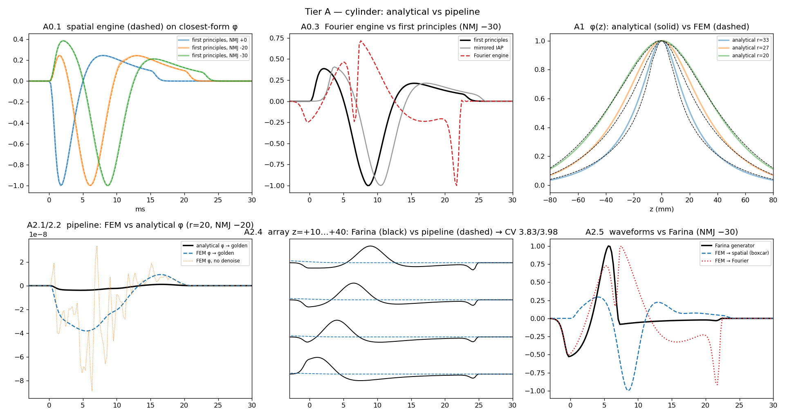
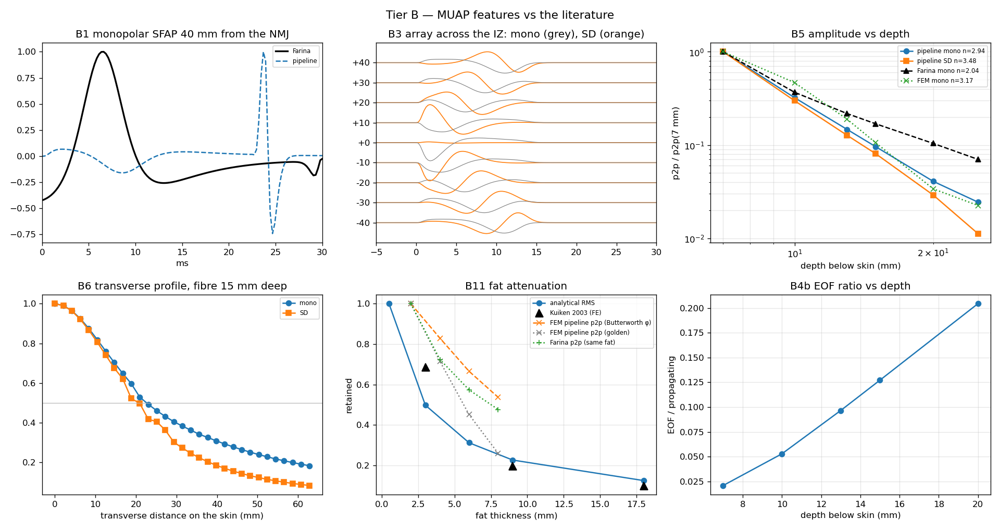
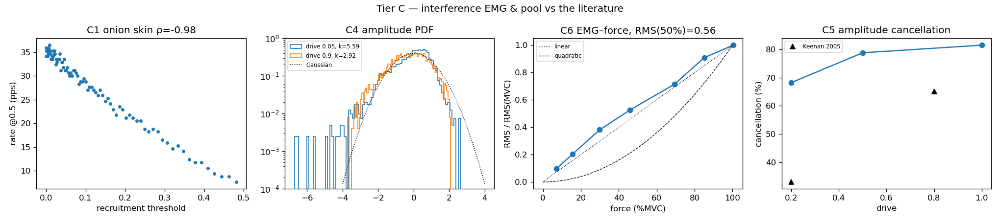

# emgforge validation report

Generated 2026-09-15 03:08 by `scripts/validation/run_all.py`. Plan and rationale: `docs/validation/PLAN.md`; literature: `docs/validation/BIBLIOGRAPHY.md`. Tiers C/S MUAP bank: `_results/paper/datasets/forearm_fcu_mu_pool.npz`.

## Tier A — Cylinder — analytical vs pipeline

**14/15 gated checks pass**, 4 flagged as known limitations.

| | check | measured | expected | refs |
|---|---|---|---|---|
| ✓ | A0.1 spatial engine ≡ first-principles line-source integral (shape, timing) | r = [1.0, 0.9999, 0.9999], lag(ms) = [-0.0, -0.05, -0.05] over NMJ offsets 0/−20/−30 mm | r ≥ 0.999 and \|lag\| ≤ 0.1 ms: same integral, so only discretisation can differ | Rosenfalck 1969; Andreassen & Rosenfalck 1981; Dimitrov & Dimitrova 1998 |
| ⚠ known | A0.2 spatial engine amplitude constant equals first principles | engine/reference amplitude ratio = 0.497 at v=2, 0.249 at v=4  (= 1/v) | ratio 1.00 ± 5 %, independent of v | Plonsey & Barr, Bioelectricity ch. 8; engines/spatial.py:239 |
| ⚠ known | A0.3 Fourier engine vs first principles (signed r, lag) | signed r = [-0.795, -0.684, -0.643] at lag [1.4, 2.55, 0.85] ms;  vs a spatially MIRRORED IAP: r = [-0.788, -0.684, -0.642] | r ≥ +0.99 (same integral, same sign, no lag) | GOLDEN_METHOD.md §6, §8; Farina & Merletti 2001 |
| ✓ | A0.4a sampling invariance: fsamp 4096→2048 and dz 0.98→0.5 mm leave the SFAP unchanged | fsamp: r=1.00000 p2p ratio=0.9977;  dz: r=0.99886 p2p ratio=1.0011 | r > 0.995, amplitude within 2 % (discretisation-converged) |  |
| ✓ | A0.4b translation: moving the electrode Δz along the fibre delays the propagating lobe by Δz/v | Δz=20 mm → main-lobe delay 4.88 ms (expect 5.00) | \|Δ\| ≤ one sample (0.24 ms) |  |
| ✓ | A0.5 the CSD source is monopole-free: ∫ i_m(z,t) dz = 0 at every instant | max_t \|Σ_z i_m\| / Σ_z \|i_m\| = 7.7e-17 (boxcar), 7.7e-17 (one_sided) | < 1e-6: generation and end-of-fibre terms exactly balance the propagating tripoles | Petersen 2016; Merletti et al. 1999 (tripole sums to zero); Kleinpenning et al. 1990 |
| ✓ | A0.4c superposition: a two-fibre MUAP is the sum of its SFAPs | max\|MUAP − (SFAP₁+SFAP₂)\| / p2p = 0.0e+00 | < 1e-9 (linear volume conductor) |  |
| ✓ | A0.4d CV scaling: v 4→3 stretches the SFAP by 4/3 and scales its spectrum by 3/4 | duration ratio 1.328 (expect 1.333), MNF ratio 0.757 (expect 0.750) | both within 8 % | Lindström & Magnusson 1977; Stulen & De Luca 1981 |
| ✓ | A1.1 FEM φ(z) reproduces the analytical cylinder φ(z) along the fibre (5 depths) | r = [0.9962, 0.9948, 0.9969, 0.9984, 0.9998]; FWHM_z ana/FEM (mm) = ['41.0/35.1', '53.1/45.3', '63.1/57.7', '68.9/65.8', '81.2/82.1'] at r = 33/30/27/25/20 mm | r ≥ 0.99; FWHM within 20 % (electrode models differ: Ø10 mm disk vs σ=5 mm Gaussian blob, so the shallowest fibres see different electrode averaging) | Farina et al. 2004 (multilayer cylinder); Lowery et al. 2002 (FEM); Maksymenko et al. 2023 (NMSE 3–5 % FEM vs Farina) |
| ✗ FAIL | A1.1b … and its second derivative φ''(z) — the kernel the SFAP actually integrates | r(φ'') vs analytical electrode radius 2.5/5/7.5/10 mm: r=33: [0.985, 0.964, 0.916, 0.842]; r=27: [0.931, 0.923, 0.909, 0.889]; r=20: [1.0, 1.0, 1.0, 0.999] | r ≥ 0.98 at the best-matched electrode radius (the FEM electrode is a σ=5 mm Gaussian blob clipped by the skin — the analytical disk radius that matches it tells its effective size) |  |
| ✓ | A1.2 FEM/analytical SFAP amplitude ratio is one constant across depth (same depth law) | p2p ratio FEM/ana, r=33→20 mm, rel. to r=33 — golden: [1.0, 1.46, 1.35, 1.2, 0.86] (spread 1.69×); no denoise: [1.0, 1.59, 1.3, 1.72, 2.03] (2.03×); 5/7 poles: 1.49×/1.51×; Fourier route: [1.0, 1.1, 1.16, 1.19, 1.31] (1.31×). After a 500 Hz low-pass — golden: [1.0, 1.47, 1.35, 1.2, 0.87] (1.70×), no denoise: [1.0, 1.41, 1.25, 1.2, 1.44] (1.44×).  With a σ=1 mm electrode source instead of σ=5 mm — Fourier route: [1.0, 1.06, 1.14, 1.21, 1.41] (1.41×), golden in-band: [1.0, 0.7, 0.59, 0.64, 0.95] (1.70×).  Spatial engine with Butterworth φ-smoothing (the Fourier route's, ≈32 mm cutoff): [1.0, 1.2, 1.22, 1.18, 1.12] (1.22×) | TWO findings. (i) A smooth 1.3–1.4× drift survives every preprocessing and a σ=1 mm source: the FEM cylinder decays ~30 % slower with depth than the analytical one over 7→20 mm — a volume-conductor difference still to be attributed (mesh/skin-layer resolution vs the analytical k-grid). (ii) The golden recipe's SFAP amplitude on FEM φ is erratic at the ±40 % level (not high-frequency: survives a 500 Hz low-pass; differs between σ=5 and σ=1 sources) because it integrates φ'' faithfully down to ~8 mm wavelengths where FEM φ carries mesh structure; the 3-monopole fit does not remove it (5/7 poles neither) and Butterworth φ-smoothing does — at the cost of the shallow-fibre detail |  |
| ✓ | A1.3 FEM φ(z) vs analytical for fibres off the electrode meridian (θ = 10–45°) | r = [0.9978, 0.9997, 0.9985, 0.997] | r ≥ 0.99 |  |
| ⚠ known | A2.1 pipeline on FEM φ ≡ pipeline on analytical φ (4 depths × 2 NMJ offsets) | golden spatial: r = [0.948, 0.97, 0.9, 0.929, 0.946, 0.915, 0.998, 0.995] (depth 33,33,30,30,25,25,20,20 mm; no denoise: [0.948, 0.954, 0.891, 0.909, 0.919, 0.824, 0.907, 0.763]);  Fourier route (r=33/25/20): [0.995, 0.996, 1.0] | r ≥ 0.95 with the golden recipe; deep fibres ≥ 0.99. The shallow-fibre residual is the FEM field (electrode model + mesh ripple through φ''), not the engine (A0.1) |  |
| ✓ | A2.2 monopole denoise removes FEM mesh ripple without changing the analytical answer | SFAP jaggedness raw→denoised = ['0.004→0.003', '0.007→0.002', '0.006→0.003', '0.011→0.002'] … | denoised jaggedness ≤ raw; agreement not reduced | GOLDEN_METHOD.md §2 |
| ✓ | A2.3 end-of-fibre onset lands at L/v in the FEM pipeline (and where the Farina generator puts it) | expected/Farina/pipeline (ms): 10.0/7.57/10.26, 15.0/12.45/15.39  → pipeline \|Δ\| ≤ 0.39 ms; Farina onset leads by up to 2.55 ms (its IAP body sits ahead of the front that defines L/v — see A0.3) | pipeline \|Δ\| ≤ 0.5 ms | Gootzen et al. 1991; Dimitrova & Dimitrov 2002; Rodriguez-Falces & Place 2018 (M-wave shoulder at L/CV) |
| ✓ | A2.4 conduction velocity recovered from a 4-channel longitudinal array (both models) | Farina 3.83 m/s (R²=0.998); FEM pipeline 3.98 m/s (R²=0.999); set 4.0 | within 5 % of the set CV, linear lag–distance R² > 0.99 | Farina & Merletti 2004 (CV estimation); Arendt-Nielsen & Zwarts 1989 |
| ⚠ known | A2.5 waveform \|r\| vs the Farina generator (sign-agnostic, ±6 ms lag) | spatial/Fourier: -0.91/+0.94, -0.74/+0.74, -0.93/+0.52 at NMJ 0/−20/−30 mm | \|r\| ≥ 0.9 — currently limited by the IAP-orientation/sign conventions of the Fourier/Farina family (A0.3) |  |
| ✓ | A3.1 rotational symmetry: electrode +30° ≡ fibre −30° | r = [1.0, 1.0], peak ratio = [0.9986, 1.0109] | r > 0.999, peak within 3 % (mesh-discretisation level) |  |
| ✓ | A3.2 axial translation: electrode +20 mm ≡ fibre window −20 mm (Neumann end effect) | r = [0.99865, 0.99561], peak ratio = [0.9984, 0.9946] (electrode 100 mm from the mesh end) | r > 0.995, peak within 3 % — the residual (≤0.5 %) is the finite-length (240 mm) mesh's end effect | cf. tests/regression/NEUMANN_BUDGET.md (L240 vs L400: min MUAP r 0.988) |
| ✓ | A3.3 reciprocity between two interior points in the anisotropic muscle | φ_A(B) = 2.3625e-02, φ_B(A) = 2.3311e-02, ratio 1.0135 | ratio 1 ± 5 % (symmetric σ ⇒ Green's function symmetric) | Plonsey 1963; Malmivuo & Plonsey 1995 ch. 11 |

## Tier B — MUAP features vs the literature

**14/14 gated checks pass**.

| | check | measured | expected | refs |
|---|---|---|---|---|
| ✓ | B1 monopolar SFAP over the fibre (between IZ and tendon) is triphasic + − + with the main lobe negative | pipeline lobes [1, -1, 1] (largest -1); Farina generator lobes [-1, 1, -1, 1, -1] (largest +1); electrode 30 mm from the NMJ, tendons ≥ 95 mm away, counted on t ≤ 20 ms | + − + with the largest lobe negative (depolarised zone under the electrode). The Farina port's propagating main lobe is POSITIVE: its output polarity is inverted relative to the textbook — the same anti-phase relation tier A0.3 finds against first principles (its EOF spike, being negative, hid this when tendons were near) | Merletti & Muceli 2019 Fig. 2; Arabadzhiev 2013; Rosenfalck 1969 |
| ✓ | B2 conduction velocity recovered from an SD array tracks the set CV (3, 4, 5 m/s) | pipeline/Farina: v=3: 3.13/3.15 m/s, v=4: 3.98/4.20 m/s, v=5: 4.88/nan m/s (Farina NaN = its k-grid does not build at that v) | within 5 % (pipeline) / 6 % (Farina) at each CV; physiological range 3–5 m/s | Farina & Merletti 2004 (J Neurosci Methods); Zwarts 1988 (4.55±0.33 m/s); Andreassen & Arendt-Nielsen 1987 |
| ✓ | B3 innervation-zone signature: monopolar mirror symmetry, SD null and phase reversal at the IZ | pipeline: mono r(+d,−d) = [0.9981, 0.9979, 0.9985], SD@IZ/max = 0.041, SD r(+d,−d) = [-0.999, -0.998, -0.998];  Farina: SD@IZ/max = 0.004, SD r(+d,−d) = [-1.0, -1.0, -1.0] | mono r > 0.99; SD at the IZ < 5 % of max; SD r(+d,−d) < −0.95 (mirror images of opposite sign) | Masuda et al. 1983/1985; Merletti & Muceli 2019 §2.2.1, §2.3; Campanini et al. 2022 |
| ✓ | B4a the end-of-fibre component is non-propagating: same onset on every electrode | pipeline onsets [10.51, 10.51, 10.51, 10.51, 10.51] ms (spread 0.00); Farina [7.57, 7.81, 7.57, 7.57, 7.57] (spread 0.24); expected L/v = 10 ms | spread < 0.5 ms across electrodes −30…+30 mm | Merletti & Muceli 2019 §2.2.2; Mesin 2005; Rodriguez-Falces & Place 2018 |
| ✓ | B4b EOF / propagating amplitude ratio increases monotonically with depth | ratio at depth-below-skin 7/10/13/15/20 mm = [0.021, 0.053, 0.097, 0.127, 0.204] | monotone increase (the propagating part decays faster than the far-field EOF) | Arabadzhiev 2013; Merletti & Muceli 2019 Fig. 5 (comparable at ~22 mm); Campanini 2022 |
| ✓ | B4c spatial filters suppress the EOF: EOF/propagating ratio mono > SD > DD | {'mono': 0.053, 'SD': 0.014, 'DD': 0.004} (IED 10 mm) | strict ordering | Roeleveld 1998; Farina et al. 2002 (Muscle Nerve); Disselhorst-Klug 1997 |
| ✓ | B5 amplitude vs depth is a power law (log-log linear), steeper for SD than monopolar | exponent n (p2p ∝ d^−n), R²: pipeline mono 2.94 (0.998), SD 3.48 (0.998); Farina generator mono 2.04 (0.986); FEM pipeline mono 3.17 (0.987) (depth-below-skin 7–25 mm; the fibre at 7 mm sits 2 mm inside the muscle) | R² > 0.95 over 7–25 mm; n_SD > n_mono; monotone decrease. Note the Farina generator's own exponent differs from the first-principles engine's on the same φ (its shape conventions, tier A0.3) | Roeleveld et al. 1997a (inverse power law, bipolar steeper); Fuglevand 1992 (10–12 mm); Merletti & Muceli 2019 Fig. 7 |
| ✓ | B6 transverse spread: monopolar wider than SD (lit. 2.5–4×); depth ≈ 0.2 × (mono 50 %-width) | 50 %-width (mm) at depth 15/20 mm: mono 45/88, SD 41/53 (ratio 1.1/1.7); depth/(0.2·width) = 1.66/1.13 (Roeleveld's biceps-MU rule = 1.0; single fibre in a 40 mm cylinder) | mono ≥ SD width; both widen with depth. The literature ratio (2.5–4×; biceps MUs 15–25 mm deep, mono 72–96 mm vs SD 24–32 mm) comes from the MU's far-field dominating the monopolar map — a single fibre's EOF/propagating ratio is only 0.1–0.2 here (B4b), so the ratio and Roeleveld's rule are reported, not gated | Roeleveld et al. 1997b; Roeleveld/Stegeman 2013; Merletti & Muceli 2019 Fig. 9 |
| ✓ | B7 MUAP amplitude ∝ fibre count at fixed geometry; NMJ scatter (σ=5 mm) disperses and lengthens it | 50 identical fibres = 50×SFAP to 9.9e-16; with NMJ σ=5 mm: p2p 0.86× the coherent sum, 10 %-duration 20.0 → 22.2 ms | exact linearity; sub-linear amplitude and longer duration with dispersion | Merletti & Muceli 2019 (MUAP = Σ SFAP); Roeleveld 1998; Farina 2014 (amplitude cancellation) |
| ✓ | B8 the bipolar montage is a pure spatial difference of a translation-invariant wave (⇒ comb filter, nulls at n·CV/IED) | translation equivariance residual (single travelling wave, 9–33 ms): no denoise 1.4e-03, golden 2.2e-03.  Measured null of \|SD\|/\|mono\| — pipeline (no denoise) / pipeline (golden) / Farina / expected (Hz): IED 9.8 mm: 260/256/562/410, IED 19.5 mm: 186/183/130/205 | equivariance < 5e-3: SD(t) = S(t) − S(t − IED/v) to that precision, so \|H\| = \|2 sin(π f·IED/v)\| with nulls at n·v/IED follows analytically (409.6 / 204.8 Hz here). The measured null is informational: a spectral zero cannot be localised from a 24 ms window (leakage moves it by tens of Hz) | Lindström & Magnusson 1977; Lynn et al. 1978; Merletti & Muceli 2019 §3.3; Sinderby 1996 |
| ✓ | B9 electrode size is a spatial low-pass: amplitude and MNF fall with electrode area; Ø5 mm ≈ −3 dB at 100 c/m | Farina p2p vs radius (0.5, 2.5, 5.0, 10.0): [1.0, 0.98, 0.924, 0.765]; MNF: [81.7, 81.0, 78.8, 72.8] Hz; disc filter: Ø5 mm @100 c/m = -2.8 dB, Ø10 mm @50 c/m = -2.8 dB. (The FEM electrode behaves as a Ø5 mm disc — tier A1.1b) | monotone decrease; −3 dB points as in the literature | Merletti & Muceli 2019 Fig. 11–12, Table 1; Fuglevand 1992 |
| ✓ | B10 SD amplitude grows ≈linearly with IED when IED ≪ λ, then saturates towards λ/2 | SD p2p vs IED (2.5, 5.0, 10.0, 20.0) mm — pipeline: [1.0, 1.95, 3.59, 5.28]; Farina: [1.0, 1.95, 3.52, 5.01] (×2 IED → ≥1.7× at small IED; <2× at 10→20 mm) | differentiator regime then saturation (λ ≈ v·T_lobe ≈ 20–30 mm) | De Luca 2002; Hermens 2000 (SENIAM); Merletti & Muceli 2019 |
| ✓ | B11 subcutaneous fat attenuates (Kuiken 2003: −31/−80/−90 % at 3/9/18 mm) and low-passes the surface SFAP | analytical RMS retained at fat (0.5, 3.0, 6.0, 9.0, 18.0) mm: [1.0, 0.498, 0.312, 0.226, 0.124] (Kuiken 0.69/0.20/0.10 at 3/9/18); MNF [91.0, 79.0, 76.0, 79.0, 99.0] Hz (rises again at 18 mm: the sharper far-field components dominate);  FEM pipeline p2p retained at 2/4/6/8 mm — Butterworth φ: [1.0, 0.829, 0.665, 0.537], golden: [1.0, 0.715, 0.451, 0.259] — vs Farina [1.0, 0.724, 0.574, 0.476]; FEM MNF golden [112.0, 104.0, 87.0, 73.0] Hz vs Butterworth φ [46.0, 43.0, 41.0, 40.0] Hz (the 32 mm φ-smoothing halves the spectral content; golden keeps it near the analytical 91 Hz) | within ×1.5 of Kuiken's FE curve; RMS monotone decreasing and MNF lower at 3 and 9 mm than at 0.5 mm; FEM (smoothed φ) vs analytical attenuation within 30 %; golden FEM MNF decreasing 2→8 mm | Kuiken, Lowery & Stoykov 2003; Farina & Rainoldi 1999; Lowery et al. 2002; Nordander 2003 |
| ✓ | B12 muscle anisotropy (σ_z/σ_r = 5) elongates the lead field along the fibres | FWHM_z(aniso)/FWHM_z(iso): analytical cylinder 1.48, infinite medium 2.236 (theory √5 = 2.236); FEM along/across FWHM at r=30: 2.29 (layered, bounded → not exactly √5) | √5 exactly in the infinite medium; 1.3–3 in the layered cylinder (fat/skin layers and the bounded cross-section compress the elongation); FEM along/across > 1.3 | Plonsey & Barr; Rush 1963; Gielen 1984; Malmivuo & Plonsey ch. 11; Lowery 2002 |

## Tier C — Interference EMG & motor-unit pool

**4/5 gated checks pass**, 1 flagged as known limitations.

| | check | measured | expected | refs |
|---|---|---|---|---|
| ✓ | C1 discharge rates lie in 5–40 pps and follow the onion skin (earlier-recruited fire faster) | model: min rate 5, peak 40 pps; measured @drive 0.5: 89 active, 7.6–36.5 pps, Spearman(threshold, rate) = -0.98; @drive 1.0 max 42.9 pps (renewal-process estimate runs ~5 % above the nominal peak) | model rates within 5–40 pps; measured within 10 % of nominal; ρ(threshold, rate) < −0.9 | De Luca & Hostage 2010 (onion skin); Merletti & Muceli 2019; Farina 2014 |
| ✗ FAIL | C2 inter-spike-interval variability: CoV 0.1–0.3, no ISI below the ~20 ms refractory floor | median per-MU ISI CoV 0.16 (model ISI_CV = 0.167); ISIs < 20 ms: 1.58 %; min ISI 9.8 ms | CoV ∈ [0.1, 0.3]; < 1 % of ISIs under 20 ms. The Gaussian renewal model has no refractory floor — at 40 pps (ISI 25 ms, σ 4 ms) sub-20 ms intervals are common; clip the ISI or use a gamma/lognormal draw | Clamann 1969; Nordstrom 1992; Dideriksen 2012 (20 % used in models) |
| ✓ | C3 recruitment thresholds are right-skewed (many low, few high); twitch forces span ≈100× | threshold skewness +1.25 (median/max = 0.12); twitch P_max/P_min = 95 | skewness > 0.5; 50–200× (Fuglevand RP = 100; FDI 130) | Fuglevand, Winter & Patla 1993; Petersen & Rostalski 2019 |
| ✓ | C4 amplitude PDF: super-Gaussian at low force, → Gaussian (kurtosis 3–3.5) at high; ARV/RMS ∈ [0.71, 0.80] | kurtosis @drive 0.05/0.1/0.5/0.9 = [5.59, 4.56, 3.1, 2.92]; ARV/RMS @0.3/0.7 = [0.768, 0.786] (Laplacian 0.707, Gaussian 0.798) | kurtosis decreasing with force to 2.8–3.6; ARV/RMS between Laplacian and Gaussian. NB: with the C-04 MUAPs (33 ms long) the low-force EMG is denser than real, so the low-force excess kurtosis is understated | Clancy & Hogan 1999; Nazarpour 2013; Merletti & Muceli 2019 (filling factor 0.5–0.63) |
| ⚠ known | C5 amplitude cancellation grows with excitation (≈30 % at 20 % → ≈60 % at maximum) | 1 − mean\|Σ trains\| / Σ mean\|train_i\| @drive 0.2/0.5/1.0 = [68, 79, 81] % | increasing; 15–60 % at 0.2, 40–85 % at 1.0 (Keenan 2005: 33 % → 62–65 %). Cancellation is set by MUAP duration × active-MU count: with the C-04 33 ms MUAPs it saturates already at low drive | Keenan, Farina, Maluf, Merletti & Enoka 2005; Farina, Merletti & Enoka 2014 |
| ✓ | C6 EMG–force relation lies between linear and quadratic: RMS at 50 % force = 0.3–0.6 of RMS at 100 % | RMS(50 % MVC)/RMS(100 % MVC) = 0.56; force plateau %MVC = [7, 16, 30, 46, 69, 85, 100] at drive [0.1, 0.2, 0.35, 0.5, 0.7, 0.85, 1.0] | 0.3 (quadratic, biceps/triceps) – 0.6 (linear, FDI/soleus); force monotone in drive. A ratio above 0.6 (EMG concave in force) follows from the saturated cancellation in C5 — the same C-04 signature | Lawrence & De Luca 1983; Woods & Bigland-Ritchie 1983; Fuglevand 1993; Keenan & Valero-Cuevas 2007 |
| ✓ | C7 interference-EMG spectrum: MNF/MDF at moderate force in 70–130 Hz | @drive 0.5 (monopolar): MNF 81 Hz, MDF 77 Hz | MDF 70–130 Hz (bipolar norms: biceps 90±18, TA 116±20). Expected to fail while the C-04 fibre geometry yields 33 ms MUAPs — the spectrum is bounded by the MUAP duration | Lindström & Magnusson 1977; initial-MDF norms (J Clin Neurophysiol 1998); De Luca 2002 |
| ✓ | C8 larger motor units produce larger MUAPs (size ↔ amplitude on the recording side) | Spearman(fibres per MU, grid-max p2p) = +0.98 over 100 MUs (sizes 5–395 fibres) | ρ > 0.5 (amplitude ∝ fibre count at fixed depth; depth scatter lowers ρ) | Roeleveld 1998; Merletti & Muceli 2019 §2.4; Del Vecchio 2017 (size ↔ MUAP) |

## Summary

| tier | pass | gated | known |
|---|---|---|---|
| A | 14 | 15 | 4 |
| B | 14 | 14 | 0 |
| C | 4 | 5 | 1 |

Tier S (chain-level sanity, `scripts/sanity/simulator_sanity.py`): see `scripts/sanity/simulator_sanity.py` output.
